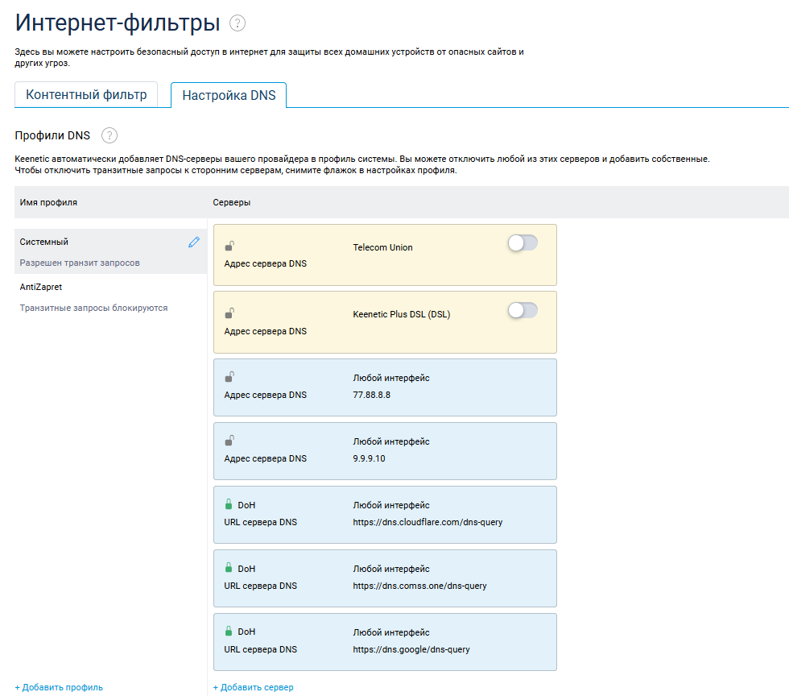

## Настройка zapret от bol-van на Keenetic

Инструкция по установке zapret от bol-van на Keenetic предполагает, что OPKG Entware уже установлен.

Оригинал статьи находится по ссылке https://telegra.ph/Nastrojka-zapret-ot-bol-van-na-Keentic-04-27

Ссылка на автора zapret на гитхабе - https://github.com/bol-van/zapret

**Обязательно любой сторонний DNS, желательно DNS-over-HTTPS, DoH**

Предварительно установите и настройте opkg на keenetic  
  
Устанавливаем пакеты:

    opkg install coreutils-sort curl git-http grep gzip ipset iptables kmod_ndms nano xtables-addons_legacy
Переходим в tmp:

    cd /opt/tmp
Скачиваем zapret:

    git clone --depth=1 https://github.com/AlexFBG/zapret.git
Переходим в каталог zapret и выполняем скрипт

    cd zapret
    ./install_bin.sh
    ./install_prereq.sh

Выбираем тип файрволла 1

    your choice (default : iptables) : 1
Из скрипта выходим Enter-ом
Запускаем проверку провайдера (должны быть отключены все блокировки)

    ./blockcheck.sh

Оставляем все по умолчанию (проходим Enter), на вопрос типа сканирования выбираем standart

При выборе сайта для сканирования, выбрать лучше из предложенных (rutracker.org) и не выбирать youtube.com и googlevideo.com, т.к. данные сайты не заблокированы, а сканер не тестирует сайты на скорость. 

По итогу получится что то вроде этого

Как видим, найденные стратегии будут отображаться как !!!!! AVAILABLE !!!!!

В конце скрипт предложит стратегию по обходу провайдера, можно выбрать ее но учитывая следующее: обход блокировки Youtube использует стратегию split2
Поэтому запоминаем, записываем в Блокнот:

    nfqws --dpi-desync=fake,split2 --dpi-desync-ttl=5
    
Начинаем установку скрипта:

    ./install_easy.sh
    

На предупреждения отвечаем Y

Папку по умолчанию оставляем как есть, отвечаем Y

Пишет, что нужно будет вручную сделать автозапуск, отвечаем Y

Выбираем iptables, жмем 1

Спрашивает про поддержку IP6, не используем, поэтому N

Выбираем nfqws, жмем 3

Предлагает отредактировать файл конфигурации. Здесь внимание! Помните мы сканировали и определяли стратегию? Поэтому жмем Y и попадаем в редактор (в зависимости какой у вас установлен по умолчанию, nano или mcedit). Редактируем верхнюю строчку и вставляем свои параметры между кавычками:

    --dpi-desync=fake,split2 --dpi-desync-ttl=5
    
Вставлять в окно SSH можно сочетанием клавиш: Shift+Insert

Сохраняем файл конфигурации, идем далее

Предлагает подключиться к интерфейсу WAN. Определить интерфейс можно запустив вторую копию ssh и ввести команду ifconfig. Ищем интерфейс с IP провайдера

Выбираем 11

После этого скрипт предложит выбрать стратегию обхода для выбранного MODE, выбираем get_antizapret_domains.sh (он по умолчанию). Произойдет скачивание листа заблокированных сайтов, установка правил. По итогу получим следующее

Здесь имеется предупреждение, что установка не закончена и необходимо вручную сделать настройки. Жмем Enter и выходим в командную строку. Делаем настройки.
Удаляем ненужное.

    cd  
    rm -rf /opt/tmp/zapret
Теперь сделаем, что бы запрет стартовал при запуске Keenetic.

    ln -fs /opt/zapret/init.d/sysv/zapret /opt/etc/init.d/S90-zapret
Правим стартовый скрипт, добавляем PATH и WS_USER  
В этом примере используется текстовый редактор nano

    nano /opt/zapret/init.d/sysv/zapret
В этом файле дописываем

    PATH=/opt/sbin:/opt/bin:/opt/usr/sbin:/opt/usr/bin:/usr/sbin:/usr/bin:/sbin:/bin
    WS_USER=nobody
Должно получиться так

Правим как у меня и сохраняем F2  
Создаем небольшой скрипт, чтобы Keenetic не забывал правила.

    nano /opt/etc/ndm/netfilter.d/000-zapret.sh

В него вставляем

    #!/bin/sh 
    [ "$type" == "ip6tables" ] && exit 0
    [ "$table" != "mangle" ] && exit 0
    /opt/zapret/init.d/sysv/zapret restart-fw

сохраним и выходим если что можете использовать файловый менеджер mc там тоже есть текстовой редактор. После команда

    chmod +x /opt/etc/ndm/netfilter.d/000-zapret.sh

Переводим net.netfilter.nf_conntrack_checksum в 0

    nano /opt/etc/init.d/S00fix

Вставляем
   
	#!/bin/sh  
	start() {  
	echo 0 > /proc/sys/net/netfilter/nf_conntrack_checksum  
	}  
	stop() {  
	echo 1 > /proc/sys/net/netfilter/nf_conntrack_checksum  
	}  
	case "$1" in  
	'start')  
	start  
	;;  
	'stop')  
	stop  
	;;  
	*)  
	stop  
	start  
	;;  
	esac  
	exit 0

Выставляем права    

    chmod +x /opt/etc/init.d/S00fix

На этом все, перегружаемся и проверяем.
